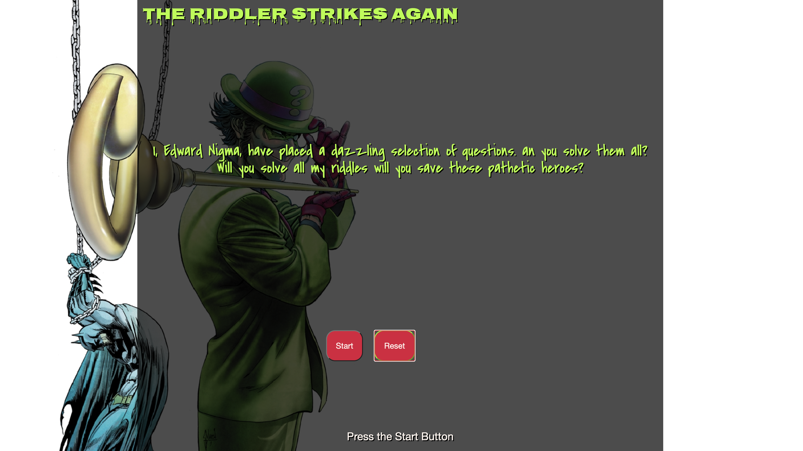
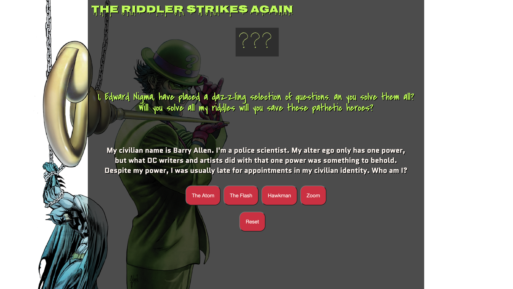

# Supeeerrr Trivia!
### Description: 
This Flashy and Quick trivia game will quiz your knowledge of the DC Universe (Disclaimer for those who don't know its anything that has to do with Batman, Superman, Wonder Woman, and their Wacky friends!)
 

## Motivation:
My desire for creating this game stems from my love of the **DC Universe** (especially the Flash!!!). Since being a young grasshopper, I sat in front of the televison every Saturday morning with a bowl of **CAP'N CRUNCH** and watched the Justice League tv series. I couldn't think of anything else that I love more, so I wanted to create something that would encompass that love as well as something I could truly enjoy devoting my ever waking moments to getting the **CSS** just right! But, enough about me, lets get to the meat of it all...

## User Persona:
Batman and the rest of the Jusice League have been captured by the Riddler and the Legion of Doom. In order to rescue the heroes, the Riddler has chosen you to challenge his intellect. It's up to you to solve every question he throws at you. 

## User Experience:
The player will have three chances to make it through all of the questions. If the player answers at least 8/10 questions correctly then the player will win the game and if not, they will lose. 

The game contains trivia style questions about the DC Universe and their super friends.

## Website Link: 
supeeerrr-trivia.surge.sh
## Wireframes

## Screenshots:

## Technology Used:
- Html
- Css
- JS
- Google Fonts
## Psuedo Code
- I need to create a board layout 5 X 6
- each answer button needs to have an event clicker
- the game needs to be able to keep score
- the game needs to generate multiple choice questions per question
- the player will lose a life if they answer incorrectly
- if the player wins or loses the board needs to stop being clickable
- the reset button nets to initialize a game reset 
## Stretch Goals:
- Add more questions to the game
- Randomize the questions and answers per play through
- Improve css
- Add difficulty choices

## Credit:
I would like to thank each and every person that was involved in helping me create this especially my instructors Ben, David and Shahzad. I would also like to give credit to the wonderful people and their creations:

- seanmorrissey96 - https://freesound.org/people/seanmorrissey96/
- Jim Carrey Online(Audio Files) - http://www.jimcarreyonline.com
- tommccann - https://freesound.org/people/tommccann/

This game uses material from the “The Riddler/Quotes” article on the Arkham City wiki at Fandom and is licensed under the Creative Commons Attribution-Share Alike License.

