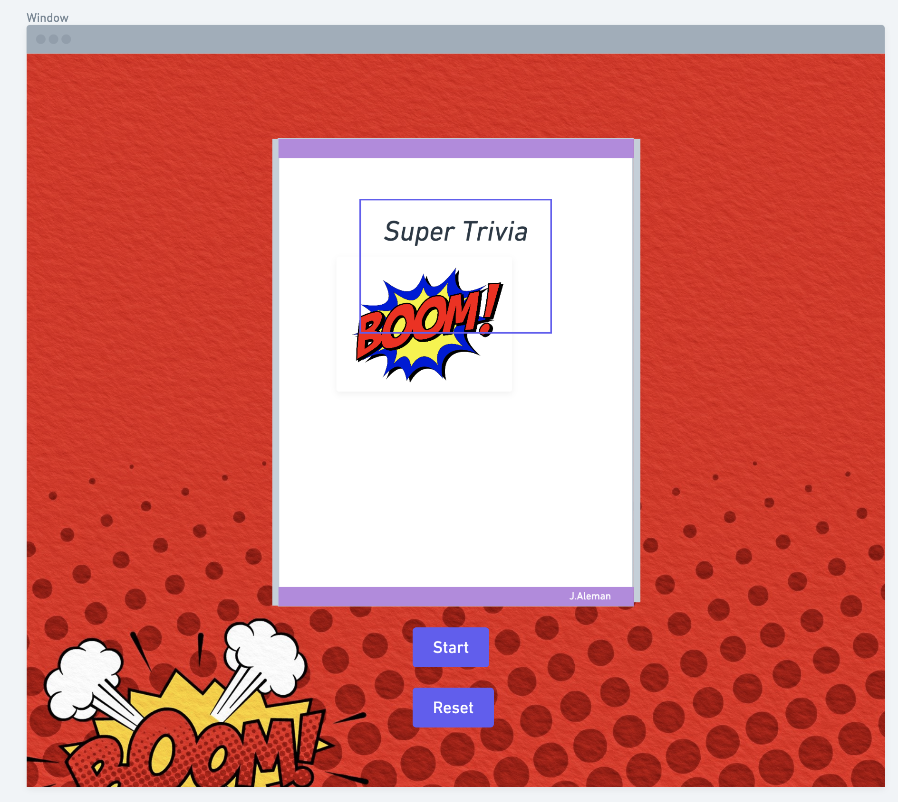

# Supeeerrr Trivia!
### Description: 
This Flashy and Quick trivia game will Quiz your knowledge of the DC Universe (Disclaimer for those who don't know its anything that has to do with Batman, Superman, Wonder Woman, and their Wacky friends!)
 

## Motivation:
My desire for creating this game stems from my love of the **DC Universe**(especially the Flash!!!). Since being a young grasshopper I sat in front of the televison every Saturday morning with a bowl of **CAP'N CRUNCH** and watched the Justice League tv series. I couldn't think of anything else that I love more, and so I wanted to create something that would resemble that love and that I could truly enjoy devoting my ever waking moments to getting the **CSS** just right! But, enough about me lets get to the meat of it all...

## User Persona:
Batman and the rest of the Jusice League have been captured by the Riddler and the Legion of Doom. In order to rescue the heroes the Riddler has chosen you to challenge his intellect. It's up to you to solve every question he throws at you. 

## User Experience:
The player will have three chances to make it through all of the questions. If the player answers at least 7/10 questions correctly then the player will win the game if not then they lose. 

The game contains trivia style questions about the DC Universe and their super heroes.

## Wireframes

## Psuedo Code

## Credit
Image by <a href="https://pixabay.com/users/aitoff-388338/?utm_source=link-attribution&amp;utm_medium=referral&amp;utm_campaign=image&amp;utm_content=4680150">Andrew Martin</a> from <a href="https://pixabay.com/?utm_source=link-attribution&amp;utm_medium=referral&amp;utm_campaign=image&amp;utm_content=4680150">Pixabay</a>

Image by <a href="https://pixabay.com/users/TyrusTime-13018745/?utm_source=link-attribution&amp;utm_medium=referral&amp;utm_campaign=image&amp;utm_content=4335468">TyrusTime</a> from <a href="https://pixabay.com/?utm_source=link-attribution&amp;utm_medium=referral&amp;utm_campaign=image&amp;utm_content=4335468">Pixabay</a>

Image by <a href="https://pixabay.com/users/neotam-11291643/?utm_source=link-attribution&amp;utm_medium=referral&amp;utm_campaign=image&amp;utm_content=4326671">neo tam</a> from <a href="https://pixabay.com/?utm_source=link-attribution&amp;utm_medium=referral&amp;utm_campaign=image&amp;utm_content=4326671">Pixabay</a>

Image by <a href="https://pixabay.com/users/AnnaliseArt-7089643/?utm_source=link-attribution&amp;utm_medium=referral&amp;utm_campaign=image&amp;utm_content=4997676">Annalise Batista</a> from <a href="https://pixabay.com/?utm_source=link-attribution&amp;utm_medium=referral&amp;utm_campaign=image&amp;utm_content=4997676">Pixabay</a>

Image by <a href="https://pixabay.com/users/AnnaliseArt-7089643/?utm_source=link-attribution&amp;utm_medium=referral&amp;utm_campaign=image&amp;utm_content=4237316">Annalise Batista</a> from <a href="https://pixabay.com/?utm_source=link-attribution&amp;utm_medium=referral&amp;utm_campaign=image&amp;utm_content=4237316">Pixabay</a>

Image by <a href="https://pixabay.com/users/DavidZydd-985081/?utm_source=link-attribution&amp;utm_medium=referral&amp;utm_campaign=image&amp;utm_content=2721690">David Zydd</a> from <a href="https://pixabay.com/?utm_source=link-attribution&amp;utm_medium=referral&amp;utm_campaign=image&amp;utm_content=2721690">Pixabay</a>

## Stretch Goals